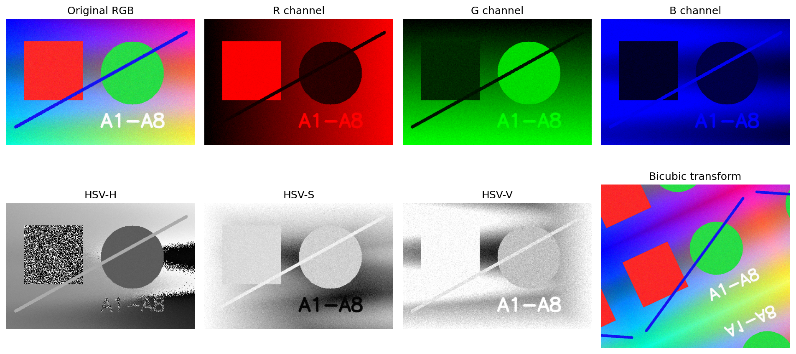

# A1 实验报告：A1 图像颜色空间、图像插值
使用的 Agent/LLM：GPT-5.5 Pro + Python/OpenCV/scikit-learn/PyTorch/Streamlit

## 一、作业要求
- 实现 RGB、HSV 颜色空间相关转换，输入图像并输出不同颜色空间每个通道图像。
- 实现最近邻、双线性、双三次、Lanczos 插值，用于放大、缩小和旋转。
- 使用 Python + OpenCV + Streamlit 做交互式应用。

## 二、实现说明
- 页面 page_a1() 提供图像上传、RGB/HSV 通道可视化、缩放倍数、旋转角度和插值方法选择。
- 核心函数 color_channel_images() 与 transform_image() 分别完成通道拆分和插值变换。

## 三、Prompt（纯文本）
请使用 Python、OpenCV 和 Streamlit 完成 A1：输入图像后展示 RGB/HSV 每个通道；提供最近邻、双线性、双三次、Lanczos 插值选择；支持放大、缩小、旋转；输出可下载结果图，并写出实验总结。

## 四、测试步骤
- 运行 streamlit run streamlit_app.py，左侧选择“A1 颜色空间与插值”。
- 上传图像或使用默认图；观察 R/G/B/H/S/V 通道图。
- 调整缩放倍数、旋转角度和插值算法，比较边缘锯齿、模糊程度和细节保留。

## 五、测试截图/输出示例

## 六、实验小结
最近邻速度快但锯齿明显；双线性较平滑；双三次和 Lanczos 对放大细节更友好。HSV 的 H 通道突出色调，S 通道表示饱和度，V 通道表示亮度。

## 七、核心源码位置
`streamlit_app.py` 中的 `page_a1()` 及其调用的辅助函数。