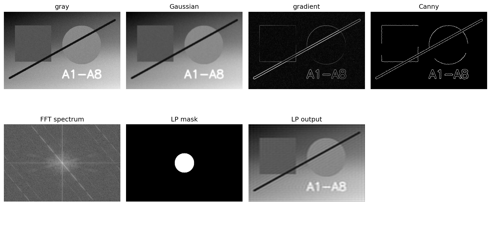

# A2 实验报告：A2 图像滤波
使用的 Agent/LLM：GPT-5.5 Pro + Python/OpenCV/scikit-learn/PyTorch/Streamlit

## 一、作业要求
- 实现常见空间图像滤波器 Box/Gaussian/Median/Sobel 并比较。
- 演示局部区域梯度方向计算。
- 实现傅里叶变换/反变换的频率域滤波，绘制频谱并比较旋转缩放下的谱图变化。

## 二、实现说明
- page_a2() 包含空间滤波、ROI 梯度矢量图、FFT 低通/高通/带通滤波。
- 核心函数 apply_spatial_filter()、gradient_roi_figure()、fft_filter()。

## 三、Prompt（纯文本）
请用 Python、OpenCV、NumPy、Streamlit 完成 A2：实现 Box/Gaussian/Median/Sobel 空间滤波；允许框选 ROI 并计算梯度方向；用 FFT 实现低通、高通、带通滤波并显示频谱、掩膜和反变换图。

## 四、测试步骤
- 进入“A2 图像滤波”页面。
- 选择不同滤波器和核大小，记录平滑、去噪和边缘增强效果。
- 用 ROI 滑块选择局部区域，观察梯度方向箭头。
- 切换低通/高通/带通滤波，比较频谱和反变换结果。

## 五、测试截图/输出示例

## 六、实验小结
均值与高斯滤波能平滑噪声，中值滤波对椒盐噪声更稳健，Sobel/Laplacian 强调边缘。低通保留整体轮廓，高通保留边缘纹理，频谱会随图像旋转而产生对应旋转。

## 七、核心源码位置
`streamlit_app.py` 中的 `page_a2()` 及其调用的辅助函数。