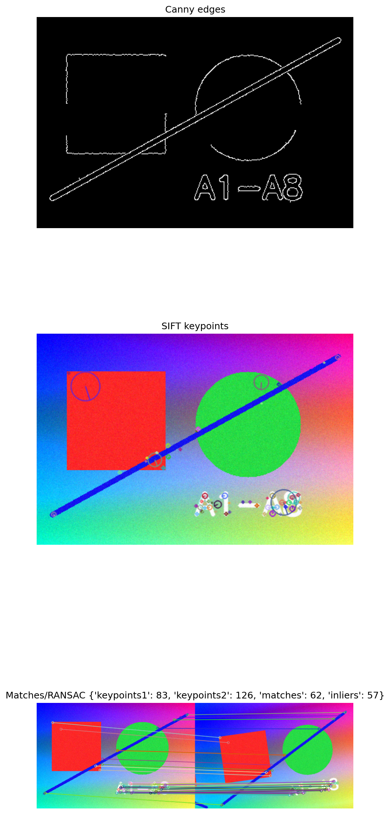

# A3 实验报告：A3 图像特征检测与匹配
使用的 Agent/LLM：GPT-5.5 Pro + Python/OpenCV/scikit-learn/PyTorch/Streamlit

## 一、作业要求
- 实现 Canny 边缘检测，并展示非最大值抑制前后对比。
- 实现 Harris、SIFT 特征点检测并可视化。
- 实现两幅图像的特征匹配、描述、初始匹配、RANSAC、变换和对齐。
- 实现多图像全景拼接并比较 blending 区别。

## 二、实现说明
- page_a3() 包含 Canny、Harris/SIFT/ORB、双图匹配与 RANSAC、OpenCV Stitcher 全景拼接。
- 核心函数 draw_canny_comparison()、detect_keypoints()、match_two_images()、stitch_images()。

## 三、Prompt（纯文本）
请用 OpenCV + Streamlit 完成 A3：实现 Canny 边缘检测与梯度候选对比；实现 Harris/SIFT/ORB 特征点可视化；对两张图做特征匹配、RANSAC 内点筛选和匹配图展示；对多张同场景图片尝试全景拼接。

## 四、测试步骤
- 进入“A3 特征检测与匹配”页面。
- 调节 Canny 双阈值，比较梯度候选图和最终边缘。
- 选择 Harris/SIFT/ORB，观察特征点位置与尺度。
- 上传两张相似图片或使用自动生成的旋转平移图，查看匹配数和 RANSAC 内点数。
- 上传多张重叠图片，生成全景结果。

## 五、测试截图/输出示例

## 六、实验小结
Canny 的双阈值影响边缘连续性；SIFT/ORB 能提供局部描述子，RANSAC 可剔除错误匹配并估计单应变换。全景拼接依赖足够重叠区域和稳定特征。

## 七、核心源码位置
`streamlit_app.py` 中的 `page_a3()` 及其调用的辅助函数。