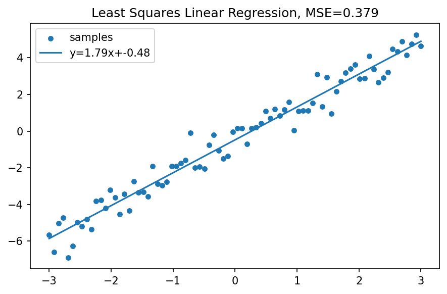
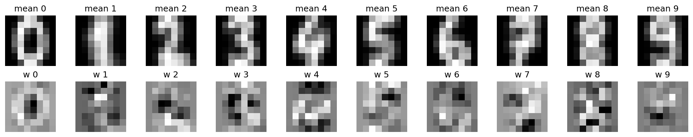
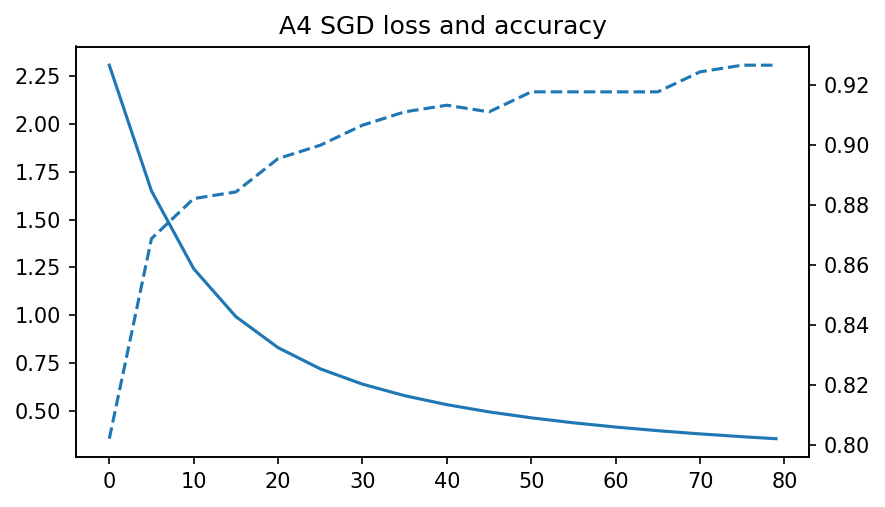

# A4 实验报告：A4 回归、KNN 与线性分类器
使用的 Agent/LLM：GPT-5.5 Pro + Python/OpenCV/scikit-learn/PyTorch/Streamlit

## 一、作业要求
- 实现 Least Squares Linear Regression 示例。
- 实现 KNN 与线性分类器图像分类。
- 展示模板图像、不同 k 的 KNN 对比、SGD/动量更新思想、梯度下降和 loss 计算过程。

## 二、实现说明
- page_a4() 包含最小二乘拟合、digits 图像数据上的 KNN/Logistic 分类、均值模板与线性权重模板、Softmax SGD loss 曲线。
- 核心函数 linear_regression_demo()、run_knn_linear_demo()、softmax_sgd_digits()。

## 三、Prompt（纯文本）
请使用 Python、scikit-learn、NumPy、Streamlit 完成 A4：实现最小二乘线性回归；用图像数据比较 KNN 不同 k 与线性分类器；可视化每类模板和线性权重；手写 softmax SGD 训练过程并显示 loss/accuracy 曲线。

## 四、测试步骤
- 进入“A4 回归/KNN/线性分类”页面。
- 调整线性回归噪声和样本数，观察拟合线与 MSE。
- 查看 KNN 不同 k 与线性分类器准确率表。
- 观察类别均值模板和线性权重模板。
- 调节 SGD epoch/学习率，观察 loss 与 accuracy。

## 五、测试截图/输出示例

## 六、实验小结
最小二乘通过正规方程/最小化平方误差得到参数。KNN 依赖样本邻域，k 越大越平滑；线性分类器学习到每类模板权重。SGD 的 loss 曲线展示了迭代优化过程。

## 七、核心源码位置
`streamlit_app.py` 中的 `page_a4()` 及其调用的辅助函数。