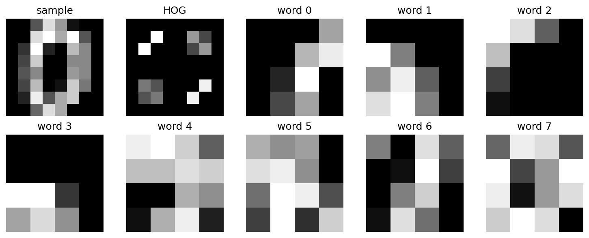
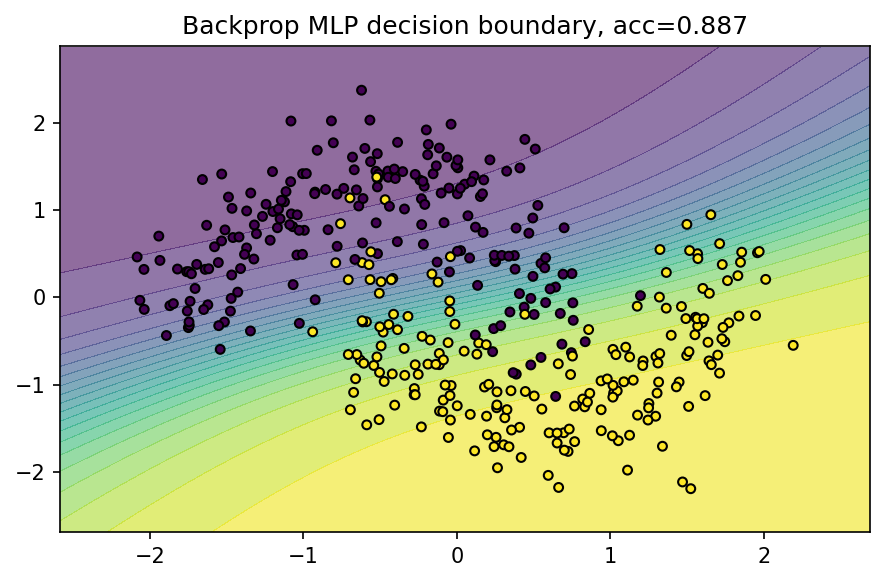
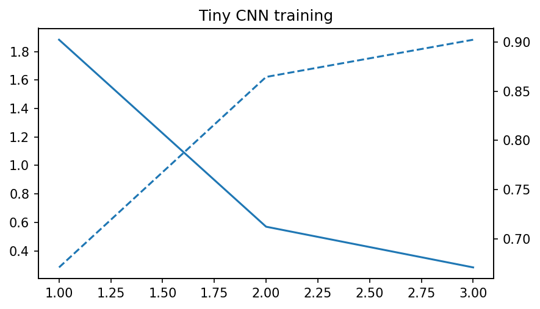
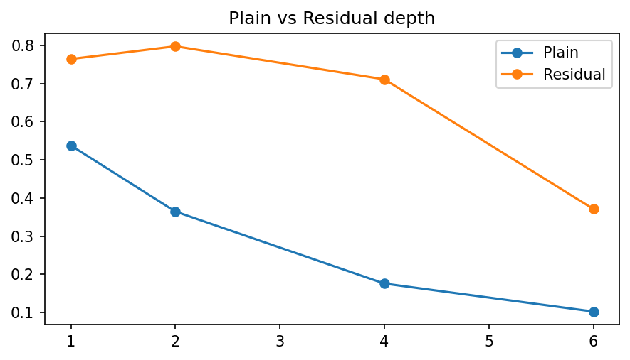

# A5 实验报告：A5 图像识别与深度网络
使用的 Agent/LLM：GPT-5.5 Pro + Python/OpenCV/scikit-learn/PyTorch/Streamlit

## 一、作业要求
- 实现 HOG + Bag of Words + SVM 图像识别/分类示例。
- 实现神经网络反向传播演示。
- 实现 CNN 模型训练和测试。
- 对比不同深度的预训练/残差网络 ResNet 性能。

## 二、实现说明
- page_a5() 包含 HOG+BoW+SVM、两层 MLP 手写反向传播、Tiny CNN、Plain MLP 与 Residual MLP 深度对比。
- 核心函数 train_bow_svm()、train_mlp_backprop()、train_tiny_cnn()、compare_resnet_depths()。

## 三、Prompt（纯文本）
请完成 A5：用 HOG 特征、视觉词袋和 SVM 做图像分类；用 NumPy 手写两层神经网络反向传播并展示决策边界和 loss；用 PyTorch 训练一个轻量 CNN；比较普通深层网络和残差连接网络在图像分类上的性能差异。

## 四、测试步骤
- 进入“A5 图像识别与深度网络”页面。
- 设置视觉词数量，查看 HOG、视觉词和 SVM 准确率。
- 调整反向传播隐藏层与 epoch，观察决策边界。
- 运行 Tiny CNN 并记录 loss/accuracy。
- 查看 Plain 与 Residual 网络深度对比图。

## 五、测试截图/输出示例

## 六、实验小结
HOG 描述边缘方向，BoW 把局部视觉词统计成直方图，SVM 完成分类。反向传播通过链式法则优化网络参数。残差连接能缓解深层普通网络训练退化。

## 七、核心源码位置
`streamlit_app.py` 中的 `page_a5()` 及其调用的辅助函数。