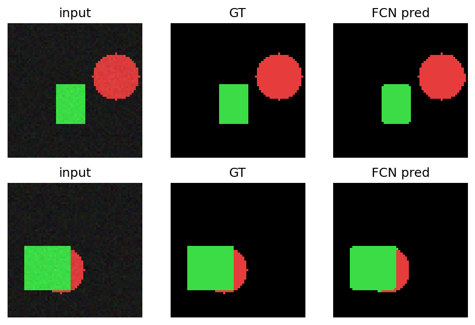
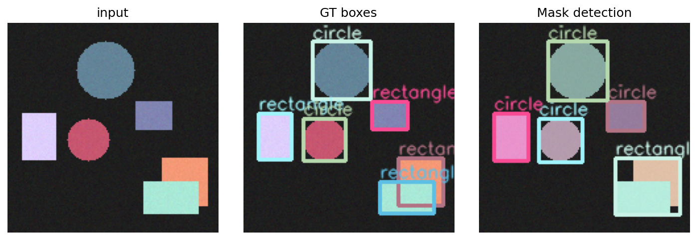

# A6 实验报告：A6 语义分割、目标检测与实例分割
使用的 Agent/LLM：GPT-5.5 Pro + Python/OpenCV/scikit-learn/PyTorch/Streamlit

## 一、作业要求
- 实现 FCN 语义分割示例。
- 实现 R-CNN/Fast/Faster R-CNN 目标检测示例。
- 实现 Mask R-CNN 图像实例分割示例。
- 对比不同方法性能。

## 二、实现说明
- page_a6() 使用合成形状数据训练 Tiny FCN 分割器，并用轮廓 proposal 展示 R-CNN/Fast/Faster R-CNN 教学流程和 Mask R-CNN 式实例掩膜。
- 核心函数 train_tiny_fcn()、generate_shape_scene()、detect_shape_instances()、detection_metrics()。

## 三、Prompt（纯文本）
请用 Python、OpenCV、PyTorch、Streamlit 完成 A6：构造一个轻量 FCN 做语义分割；展示 R-CNN/Fast/Faster R-CNN 的 proposal、分类、框和性能对比流程；输出 Mask R-CNN 式实例 mask，并用表格比较耗时、proposal 数和 IoU。

## 四、测试步骤
- 进入“A6 分割与检测”页面。
- 运行 FCN 训练，查看输入、GT mask、预测 mask。
- 调整随机种子生成不同目标检测场景。
- 查看检测框、实例掩膜、proposal 数、耗时和 IoU 表。

## 五、测试截图/输出示例

## 六、实验小结
FCN 输出像素级类别；R-CNN 系列从区域 proposal 到共享特征再到 proposal 网络逐步提高效率；Mask R-CNN 在检测框基础上增加实例掩膜分支。本项目采用轻量合成数据保证云端可部署。

## 七、核心源码位置
`streamlit_app.py` 中的 `page_a6()` 及其调用的辅助函数。