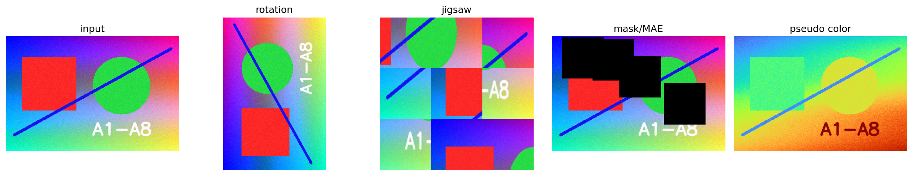
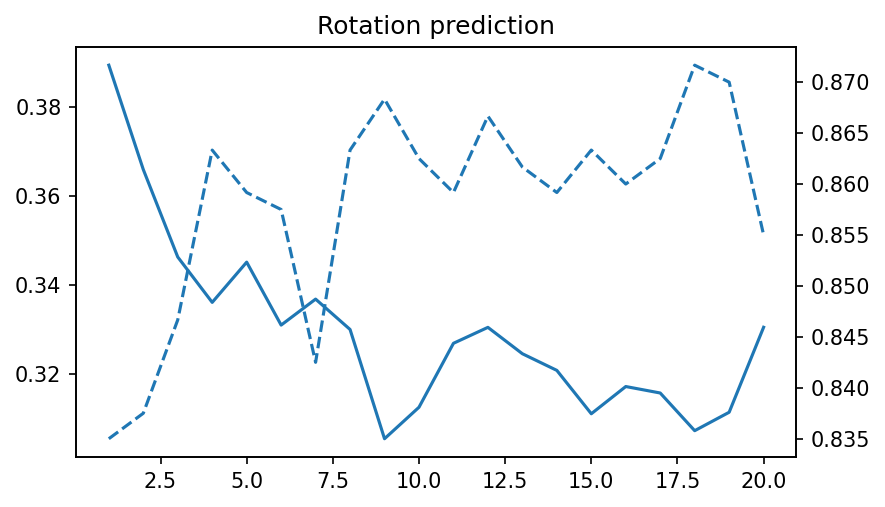
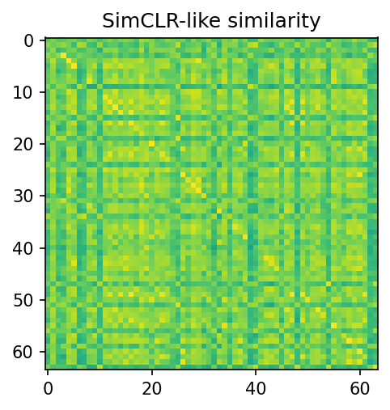

# A7 实验报告：A7 图像变换类自监督学习
使用的 Agent/LLM：GPT-5.5 Pro + Python/OpenCV/scikit-learn/PyTorch/Streamlit

## 一、作业要求
- 实现图像变换类自监督示例，如旋转预测、拼图重排、图像补全或颜色化。
- 实现 MAE 或 SimCLR 简化示例。
- 可视化输入、变换/遮挡后的图像、模型输出、loss 或准确率变化。
- 对比不同设置效果。

## 二、实现说明
- page_a7() 包含旋转、拼图、遮挡、伪彩色化，旋转预测 pretext task，SimCLR 简化正负样本相似度和 InfoNCE loss。
- 核心函数 jigsaw_image()、mask_image()、rotation_pretext_classifier()、simclr_like_stats()。

## 三、Prompt（纯文本）
请完成 A7：用图像旋转预测作为自监督 pretext；实现拼图重排、遮挡/MAE、颜色化展示；实现 SimCLR 简化版正负样本对比，输出相似度矩阵、InfoNCE loss，并比较不同增强强度。

## 四、测试步骤
- 进入“A7 自监督学习”页面。
- 上传图像或使用默认图，观察旋转、拼图、遮挡和颜色化。
- 运行旋转预测，查看 loss/accuracy 曲线和预测角度。
- 调节增强强度，观察 SimCLR 正样本和负样本相似度变化。

## 五、测试截图/输出示例

## 六、实验小结
自监督学习通过人为构造标签训练表征。旋转预测要求模型理解图像结构；SimCLR 强化同一图像不同增强视图的一致性；MAE 思想通过遮挡重建学习上下文。

## 七、核心源码位置
`streamlit_app.py` 中的 `page_a7()` 及其调用的辅助函数。