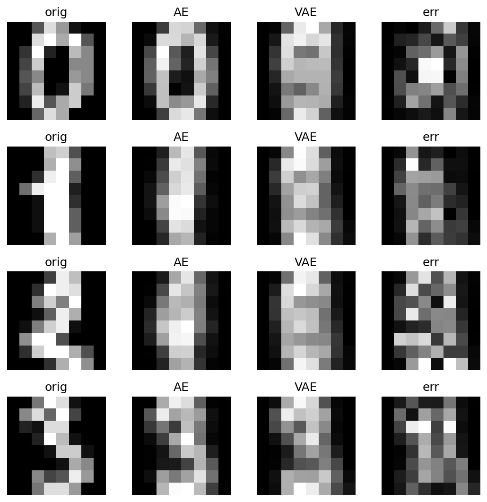
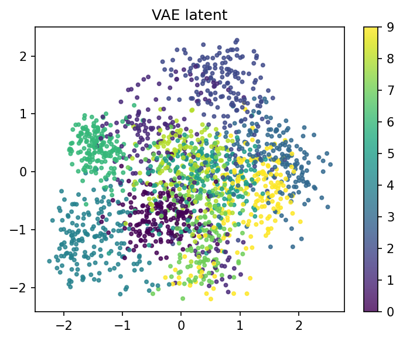
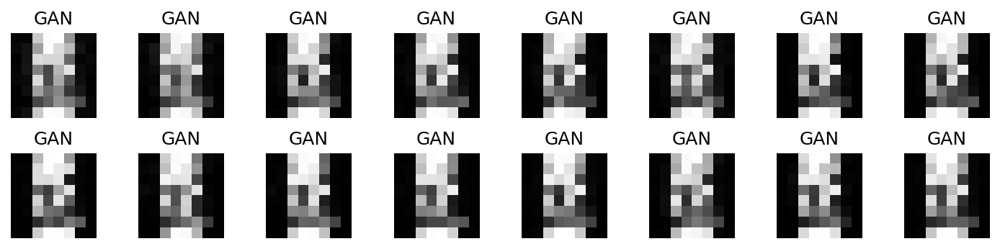

# A8 实验报告：A8 自编码器、VAE、GAN 与提示参数实验
使用的 Agent/LLM：GPT-5.5 Pro + Python/OpenCV/scikit-learn/PyTorch/Streamlit

## 一、作业要求
- 实现自编码器与 VAE 重构对比，展示重构结果、误差热力图和 loss 曲线。
- 提供 VAE 二维潜空间散点图，支持潜空间生成与插值。
- 实现 GAN/扩散模型与文本提示参数实验，比较 prompt、negative prompt、guidance scale 等参数影响。

## 二、实现说明
- page_a8() 训练 AE/VAE，展示重构、误差、二维 latent、潜空间插值；训练轻量 GAN；用 VAE 潜空间模拟 prompt/negative/guidance 可控生成。
- 核心函数 train_ae_vae()、decode_vae_latent()、train_tiny_gan()。

## 三、Prompt（纯文本）
请用 PyTorch + Streamlit 完成 A8：在 digits/MNIST 类图像上训练 Autoencoder 和 VAE，展示重构、误差热力图、loss 曲线、二维潜空间和插值；训练轻量 GAN；实现 prompt、negative prompt、guidance scale 和 noise 参数对生成图像的影响对比。

## 四、测试步骤
- 进入“A8 生成模型”页面。
- 运行 AE/VAE 训练，查看原图、AE 重构、VAE 重构和误差。
- 在二维潜空间散点图中观察类别分布，用 z1/z2 滑块生成图像。
- 选择两个样本进行潜空间插值。
- 运行轻量 GAN，并比较 prompt/negative/guidance 参数生成结果。

## 五、测试截图/输出示例

## 六、实验小结
AE 学习确定性压缩重构，VAE 学习连续概率潜空间，因而更适合采样和插值。GAN 通过生成器/判别器对抗训练生成样本。prompt/negative/guidance 可理解为在潜空间中靠近目标语义、远离负语义并控制生成强度。

## 七、核心源码位置
`streamlit_app.py` 中的 `page_a8()` 及其调用的辅助函数。